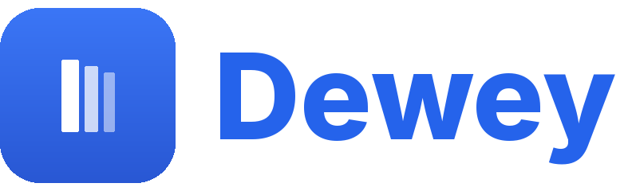

<p align="center">
  
</p>

<p align="center">
  <b>An Android document app that finds the file you can't name.</b><br>
  On-device search and sorting · a complete free PDF toolkit · a paid tier on RevenueCat
</p>

<p align="center">
  <a href="#what-it-does">What it does</a> ·
  <a href="#revenuecat">RevenueCat</a> ·
  <a href="#how-it-works">How it works</a> ·
  <a href="#build">Build</a> ·
  <a href="#whats-not-done">What's not done</a>
</p>

---

Everyone's Downloads folder has a `2847373.pdf` in it. You remember it was the
electricity bill from the month the meter was replaced. You do not remember that
it is called `2847373.pdf`. Dewey is built around that gap: it reads every PDF
you point it at, **on the phone**, files each one into a folder it creates, and
answers questions about them in plain language.

Built for **RevenueCat Shipaton 2026**. The corpus it is built and measured
against is Moroccan: French, Arabic and English, often in one document.

| | |
|---|---|
| **Sorts a folder** | 97 of 100 test documents filed, **none wrong**; the other 3 held for review rather than guessed. Undoable. |
| **Finds by meaning** | 81% recall@1, 95% recall@3 over the test corpus, in three languages. |
| **Sends nothing to sort** | Classification is a nearest-neighbour lookup on on-device embeddings. No network call. |
| **Monetised honestly** | The scanner and all 14 PDF tools are free, with no ads. The paywall sells the part that reads your documents for you. |

---

## What it does

### Free, with no ads and no account

- **Scanner.** Edge detection, perspective correction, multi-page capture, OCR.
- **Fourteen PDF tools**, each writing a new file and never over the original:
  merge, split, extract, rotate, reorder and delete pages; PDF to images and
  images to PDF; compress; add or remove a password; watermark; page numbers;
  and **sign** (draw a signature once, place it on any page).
- **Page grids.** The page tools open a PDF as thumbnails. Drag to reorder;
  tap to pick pages to extract, delete or rotate; tap expand for a page full screen.
- Recent files on Home, and a **Quick scan** home-screen widget.

### Librarian, the paid tier (a RevenueCat entitlement)

- **Documents.** Link a folder and browse it by what each document *is*: bills,
  statements, contracts, medical, tax, papers, and more.
- **Sort.** Reads every PDF, works out what it is, creates folders and moves it.
  Unsure files go to a review queue instead of being guessed. The whole sort can be undone.
- **Ask.** An assistant that answers from what is actually in your files and
  shows the documents it used. "When is the Lydec bill due?" works in French and
  Arabic documents too. Capped at 50 questions a day.
- **Bills and notes.** Detected bills with vendor, amount and due date, grouped
  by how soon they are due, plus notes of your own, standalone or pinned to a
  bill. Both are home-screen widgets.

### An optional account

Sign in with an email on the Me tab and Librarian follows you to a new phone.
The account holds no documents; they stay on the device either way. Details in
[RevenueCat](#revenuecat).

---

## RevenueCat

The paid tier is one RevenueCat entitlement, `dewey_app_pro`, sold through two
packages (monthly and annual) on the current offering. Every part of the purchase
path goes through the SDK. None of it is hardcoded.

| What | Where | SDK |
|---|---|---|
| Configure at app start, with the signed-in user's id if there is one | [`billing/Entitlements.kt`](app/src/main/kotlin/app/dewey/billing/Entitlements.kt) | `Purchases.configure`, `PurchasesConfiguration.Builder.appUserID` |
| Live entitlement state for every screen | same | `UpdatedCustomerInfoListener`, `awaitCustomerInfo`, `entitlements[…].isActive` |
| A paywall drawn by the app, with prices from the dashboard | [`ui/billing/paywall/`](app/src/main/kotlin/app/dewey/ui/billing/paywall) | `awaitOfferings().current`, `Package`, `StoreProduct.price`, `pricePerMonth`, `period`, free-trial detection |
| Buying | [`RevenueCatLibrarianBilling.kt`](app/src/main/kotlin/app/dewey/ui/billing/paywall/RevenueCatLibrarianBilling.kt) | `awaitPurchase(PurchaseParams)`, on `Dispatchers.Main.immediate` |
| Restoring, which only reports success if Librarian actually came back | same, and the Me tab | `awaitRestore` |
| Identity: signing in makes the RevenueCat customer the account, not the install | [`auth/Account.kt`](app/src/main/kotlin/app/dewey/auth/Account.kt), `Entitlements.identify/forget` | `awaitLogIn`, `awaitLogOut`, `isAnonymous`, `setEmail` |
| Self-serve subscription help: restore, cancel, change plan | [`ui/me/MeScreen.kt`](app/src/main/kotlin/app/dewey/ui/me/MeScreen.kt) | `CustomerCenter` from `purchases-ui` |
| Manage subscription link | [`ui/me/MeViewModel.kt`](app/src/main/kotlin/app/dewey/ui/me/MeViewModel.kt) | `CustomerInfo.managementURL` |

The core of it:

```kotlin
// billing/Entitlements.kt — configured before anything can ask whether a feature is unlocked
Purchases.configure(
    PurchasesConfiguration.Builder(context, BuildConfig.REVENUECAT_KEY)
        .apply { if (appUserId != null) appUserID(appUserId) }
        .build()
)
Purchases.sharedInstance.updatedCustomerInfoListener =
    UpdatedCustomerInfoListener { info -> state.value = info.entitlements[LIBRARIAN]?.isActive == true }

// Signing in: whatever was bought anonymously on this phone moves to the account.
state.value = Purchases.sharedInstance.awaitLogIn(userId).customerInfo.hasLibrarian()
```

**Why a custom paywall.** It is drawn in the app's own design, but it is still
data-driven. The offering and every price come live from the dashboard, the
"Save N%" badge is computed from the two products' real prices, the struck-through
"a year paid monthly" price only appears when there is a real saving, and a free
trial is only mentioned when a product actually has one. The paywall appears
where the value is: on the locked Documents, Notes and assistant screens, which
show what they would do before asking for anything.

**Purchases are simulated.** This entry is judged on a repo and a video and is
never going to a store, so it uses RevenueCat's **Test Store**: a self-contained
sandbox with no Play Console and no real products. RevenueCat refuses a Test
Store key in a non-debuggable build (rightly, since such a key earns nothing), so
there is a separate `demo` build type. The `release` variant carries no purchase
key at all, which is a stronger guarantee that a test key cannot reach a store
than remembering not to ship one.

**No key, no lock.** A clone with no `revenuecat.properties` unlocks every
feature instead of locking them. There is nothing to buy without a purchase
system, and a repo someone clones to read should run.

---

## How it works

### Storage: SAF, not `MANAGE_EXTERNAL_STORAGE`

Dewey uses the Storage Access Framework's document-tree picker. You grant it one
folder; it gets that folder.

The alternative, `MANAGE_EXTERNAL_STORAGE`, is easier to write against — real
file paths, no permission dance — and since this app is not shipping to Play,
its restrictions would not have bound us. We still didn't use it. Asking for
read-write access to the whole device in order to tidy one folder is the wrong
trade for the user, and a document app that demands it has answered a design
question by avoiding it.

The practical consequence, which shapes a lot of the code: **SAF hands back
content URIs, not file paths.** Nothing in the app may assume a `File`.

There is a real cost, and it is worth stating rather than hiding. Since Android
11 the system refuses to grant a document tree over the `Download` root itself —
the picker says "Can't use this folder" and disables the button. The same applies
to the storage root and `Android/data`. Any *subfolder* of Downloads is granted
normally, so Dewey works on `Download/Statements` but cannot be pointed at
`Download` wholesale.

`MANAGE_EXTERNAL_STORAGE` would lift that restriction. It is not used here. The
platform is drawing a deliberate line around a folder full of everything a person
has ever downloaded, and an app that reads one folder does not need a key to all
of them — which is the same reasoning that chose SAF in the first place, so
honouring it when it is inconvenient is rather the point.

### Retrieval: embeddings computed on-device

Every document is embedded once at import, on the phone, using
`multilingual-e5-small` through ONNX Runtime Android. Vectors persist locally and
are never recomputed per query.

Multilingual is a requirement rather than a nicety here. The corpus this is built
for is Moroccan: French, Arabic and English, often mixed inside one document. An
English-only encoder would fail most of it.

Computing embeddings on-device costs APK size and a couple of seconds per
document at import. It buys the thing that makes the privacy claim below true
rather than aspirational: the corpus never leaves the phone in order to become
searchable.

### What actually leaves your device

Stated precisely, because vague privacy claims are worse than none:

- **Document text stays local by default.** Import, OCR, embedding, indexing and
  retrieval all run on the phone.
- **Retrieved chunks go to a cloud model.** When you ask a question, the passages
  retrieved for it are sent to Gemini via Firebase AI Logic to compose an answer.
  Not your corpus — the passages that matched.
- **Sorting sends nothing.** Classification is a nearest-neighbour lookup against
  on-device embeddings, so filing four hundred documents makes no network call.
- **Purchases go through RevenueCat**, which is how the entitlement is checked.
- **The optional account** sends its email and password to Firebase
  Authentication, and its user id and email to RevenueCat as the customer id.

This is not an offline app and it does not claim to be.

### Sorting runs on the phone

The obvious design sends every document to a cloud model to be labelled. Dewey
does not, because it does not need to: each document is already embedded for
search, and a category is another point in the same space, so a label is a
nearest-neighbour lookup against a short description of each kind of document.

Measured against the test corpus's own labels, it files 97 of 100 documents and
gets **every one of those 97 right**; the other three go to review rather than
being guessed at. That is across thirteen categories described in French, Arabic
and English. It costs nothing per file,
works with no network, and means sorting a folder sends nothing anywhere at all.

A real Downloads folder is not only admin, so `Papers` is one of the thirteen:
fifteen arXiv papers and an RFC are all recognised as papers, fourteen of
them confidently enough to file. It was worth measuring rather than assuming,
because a maths-heavy phrasing tried during
tuning pulled an English university transcript into Papers and was dropped for it.

It also declines to answer. A document has to clear 0.80 similarity against a
category before the sort will act on it; below that it is left exactly where it
is and surfaced for review rather than confidently filed somewhere wrong. Two of
those sixteen papers land there — right about what they are, not quite sure
enough to move. Erring high is deliberate: review is a mild annoyance, a
confident misfile costs trust in the whole feature.

Every move is written to an undo log as it happens, so an interrupted sort is
still reversible, and the button that reverses it sits next to the one that
starts it.

### Cloud access: Firebase AI Logic

The repo is public, so an API key cannot live in it. Firebase AI Logic proxies
the request through Google's own credentials, which arrive in
`google-services.json` — a file this repo does not commit and does not need to
build. So no key is in the source, and there is no separate backend to deploy or
keep alive.

App Check would be the next thing to add here: it is what stops a copy of the
config file being used from somewhere that is not this app. It is not wired up
yet, and the app builds and runs without it.

### Long-running work

Sorting four hundred files is not a screen's job. Batch sort, indexing and
exports run in a WorkManager job owned at the application level. Screens observe
progress; they do not own the work. Closing the screen does not cancel the sort,
and cancelling actually reaches the running task.

---

## Build

Requires JDK 17 and the Android SDK. Both live under `$HOME` in this setup — no
root, nothing installed system-wide:

```
git clone https://github.com/Yunsmn/dewey && cd dewey
. scripts/env.sh          # JAVA_HOME, ANDROID_HOME, PATH
./gradlew assembleDebug
```

`scripts/env.sh` honours `JAVA_HOME` and `ANDROID_HOME` if you already have them
set, so it will not fight an existing Android Studio install.

If you need the SDK from scratch, the command-line tools bootstrap themselves:

```
mkdir -p ~/Android/Sdk/cmdline-tools && cd ~/Android/Sdk/cmdline-tools
curl -LO https://dl.google.com/android/repository/commandlinetools-linux-16111833_latest.zip
unzip -q commandlinetools-*.zip && mv cmdline-tools latest
latest/bin/android sdk install platform-tools "platforms;android-36" "build-tools;36.0.0"
```

Firebase configuration is not committed. To run the Librarian tier you need your
own `google-services.json` in `app/` — see [docs/firebase-setup.md](docs/firebase-setup.md).
The free tier builds and runs without it.

### The encoder

The encoder is not committed — 118MB of third-party weights do not belong in git
history. Fetch and prepare it before building or running the tests:

```
tools/eval/fetch_model.sh
python tools/model/prepare_assets.py --model-dir tools/eval/model
```

That downloads `Xenova/multilingual-e5-small` (an ONNX export of
`intfloat/multilingual-e5-small`, MIT licensed), packs its 250k-entry
SentencePiece vocabulary into a compact binary the app can load without parsing
17MB of JSON at startup, and writes the fixtures the tokenizer is tested against.

The Kotlin tokenizer is checked token-for-token against HuggingFace `tokenizers`
on French, Arabic, mixed-script, emoji and malformed input. This matters more
than it looks: a tokenizer that is subtly wrong never crashes, it just quietly
produces slightly wrong vectors and slightly worse search, forever.

### The test corpus

`tools/corpus/` generates the archive this app is developed and evaluated
against: 100 Moroccan documents in French, Arabic and English — utility bills,
bank statements, rental contracts, invoices, medical letters, transcripts,
insurance policies, tax forms — with the uninformative filenames real archives
actually contain (`Scan_20240312_004.pdf`, `Nouveau document 7.pdf`).

It is confusable on purpose. Six consecutive months of Lydec bills, six
consecutive Attijariwafa statements, repeat visits to the same clinic. Retrieval
that only works on a corpus of obviously-different documents measures nothing.

Every generated document is round-trip verified: text is extracted back out of
the finished PDF and checked against the source, gated at 0.92 token recall.
Arabic in particular loses content at direction boundaries, and a document whose
text didn't survive would quietly corrupt the evaluation.

```
python -m venv .venv && ./.venv/bin/pip install -r tools/corpus/requirements.txt
./.venv/bin/python tools/corpus/generate_corpus.py
```

Writes `tools/corpus/corpus/` and a `ground_truth.json` answer key.

### Tests

```
./gradlew :app:testDemoUnitTest
```

Over 760 JVM unit tests, including PDFBox round trips on real documents and
the tokenizer checked token for token against HuggingFace.

---

## What's not done

Kept current and honest.

- [x] **Storage, extraction, on-device index.** Verified on a device against 114
      real documents, including a 1012-page scan with no text layer.
- [x] **Find.** Hybrid retrieval on the device, with the answer layer on Gemini
      through Firebase AI Logic.
- [x] **Sort.** Classification, folder creation, moves, review queue and undo,
      confirmed end to end on a signed build: 96 of 114 real documents filed into
      11 folders, the rest held back for review.
- [x] **Bills, notes, widgets, the assistant, the Me tab, light and dark.**
      Checked on the emulator, including the assistant answering bill questions
      from French and Arabic documents in 7 to 12 seconds.
- [x] **RevenueCat purchase.** A Test Store purchase through the custom paywall
      unlocks the paid tabs.
- [x] **PDF toolkit.** Merge, extract, rotate, delete and reorder checked on a
      device by reading the output PDFs back. So were password protect and
      unlock, watermark, page numbers, compress, and PDF to and from images.
- [ ] **Not yet checked on a device:** the page-thumbnail grids, Sign, Split,
      the optional account, and the Customer Center screen. They are unit-tested
      where they have logic worth testing, but nobody has used them on a screen yet.
- [ ] **Widgets on a real launcher**, rather than opened by intent.
- [ ] **App Check.** Not wired up, so the Firebase config in an APK could be
      reused from outside the app.

Measured, not asserted: retrieval is 81% recall@1 and 95% recall@3 over the test
corpus; classification files 97 of 100 documents with none wrong across thirteen
categories. The app also learns categories from folders you already keep: a
folder of your own documents describes them about three times more sharply than
any description we wrote (margin 0.089 against 0.027, leave-one-out). Every
harness is in `tools/eval/` and can be re-run.

---

## Licence

MIT. See [LICENSE](LICENSE).
